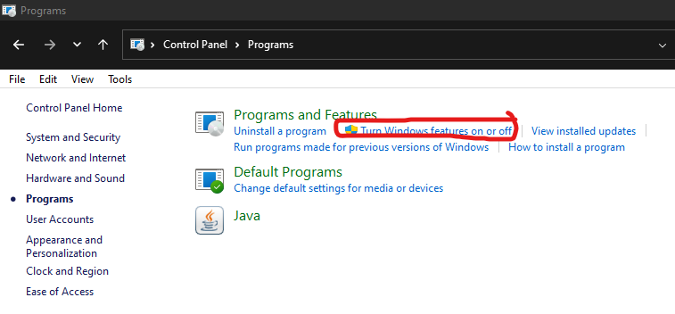

# Installing IIS on Windows 10/11

Open Control Panel and click Programs and Features **OR** Programs > Turn Windows features on or off.

Enable Internet Information Services.

.png>)

Enable CGI to make PHP work properly.

.png>)

Click OK.

